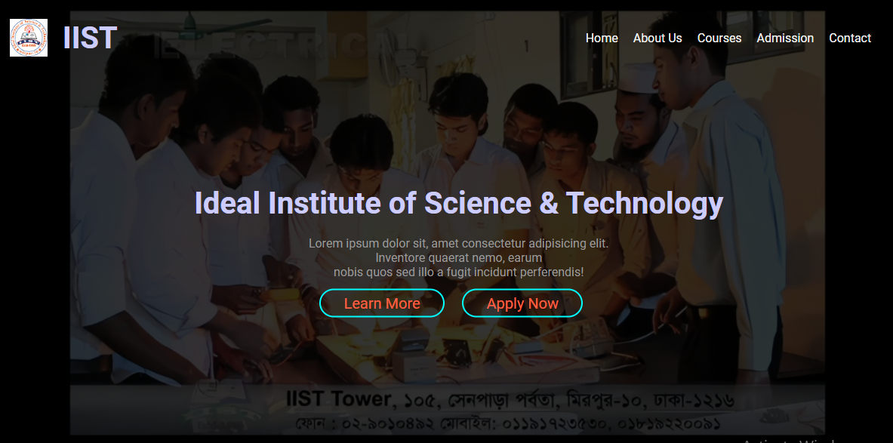
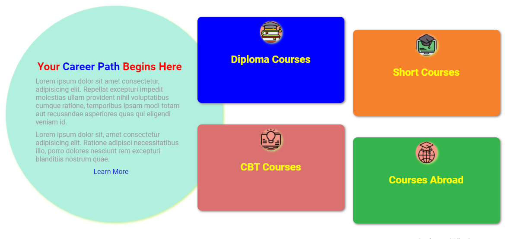

  

# HTML-Project-2
 👉 Create a Web Design using HTML &amp; CSS Project-2  
---
### Youtube Link of HTML-Project-2  
[Web Design-Project-2](https://youtu.be/aqvRafv_5nc)  
---
 ### Playlists Link for Web Design & Web Development of me  
1. [Web Design Project-1](https://www.youtube.com/playlist?list=PLxqLmn_MNa-Sl7EtwOFCV4zWEwleEd3mk)  
2. [Web Design Project-2](https://www.youtube.com/playlist?list=PLxqLmn_MNa-Rfie-DoTgRRnUnXxZKGZip)  
3. [Web Development Level-IV Certificate](https://www.youtube.com/playlist?list=PLxqLmn_MNa-Sv8NyBi2i97qDElbCeWcdW)
---

### Useful Resources for Web Design for Free Downloadable Images & Videos : 
1. [Unsplash](https://unsplash.com/)
2. [Pixa Bay](https://pixabay.com/)
3. [Pexels](https://www.pexels.com/)  
4. [Free Images](https://www.freeimages.com/)    

### Useful Resources for Web Design for Free Downloadable Illustrations:   
1. [Undraw](https://undraw.co)
2. [Free Pik](https://www.freepik.com)
3. [Vecteezy](https://www.vecteezy.com/)
4. [Storyset](https://storyset.com/)     

### Usable Gradient Colors Source:  
- [Web Gradients](https://webgradients.com/)  
- [CSS Gradient](https://cssgradient.io/)   

### Useful Resources for Web Design for Free Downloadable for icons  
- [Free Icons](https://freeicons.io/)  
- [Flat Icons](https://www.flaticon.com/)  

### Useful Resources for Web Design for Free Downloadable for background remove from Image
- [Remove BG](https://www.remove.bg/)
- [Adobe BG](https://www.adobe.com/express/feature/image/remove-background)

### Useful Resources for Web Design for Free Downloadable for Photo Editor & Design Maker
- [Pix Lr](https://pixlr.com/e/) 
- [Picture Resize](https://picresize.com/) 
- [Adobe Resize](https://www.adobe.com/express/feature/image/resize) 
- [Biteable](https://biteable.com/tools/image-resizer/) 

---  

 ### HTML Code  
~~~html
<!DOCTYPE html>
<html lang="en">
<head>
    <meta charset="UTF-8">
    <meta http-equiv="X-UA-Compatible" content="IE=edge">
    <meta name="viewport" content="width=device-width, initial-scale=1.0">
    <title>HTML-Project-2</title>
    <link rel="stylesheet" href="style.css">
</head>
<body>
    <!-- Header Part Start -->
    <header>
        <nav class="navbar">
            
            <h1>IIST</h1>
            <ul class="nav-list">
                <li class="list-item"><a href="#">Home</a></li>
                <li class="list-item"><a href="#">About Us</a></li>
                <li class="list-item"><a href="#">Courses</a></li>
                <li class="list-item"><a href="#">Admission</a></li>
                <li class="list-item"><a href="#">Contact</a></li>
            </ul>
        </nav>
        

            <h1>Ideal Institute of Science & Technology</h1>
            
Lorem ipsum dolor sit, amet consectetur adipisicing elit.  Inventore quaerat nemo, earum  nobis quos sed illo a fugit incidunt perferendis!

            <a href="#" class="learn-more">Learn More</a>
            <a href="https://iist-mirpur.edu.bd/online-application/" target="_blank" class="btn">Apply Now</a>
        

    </header>
    <!-- Header Part End -->
    <!-- service part start -->
    <section class="services">
        

            

                
            

            <h1>Your Career Path Begins Here</h1>
            
Lorem ipsum dolor sit amet consectetur adipisicing elit. Ex, nisi cupiditate ea illo itaque architecto error eos aperiam expedita velit, delectus similique amet fuga tempore qui animi excepturi, quibusdam quasi.

            
Lorem ipsum dolor sit amet consectetur adipisicing elit. Totam soluta eius eos officiis exercitationem esse inventore minus cupiditate mollitia corporis?

            <a href="#">Learn More</a>
        

        

            <a href="diploma.html">
                

                    
                    <h1>Diploma Courses</h1>
                

            </a>
            <a href="diploma.html">
                

                    
                    <h1>Short Courses</h1>
                

            </a>
            <a href="diploma.html">
                

                    
                    <h1>CBT Courses</h1>
                

            </a>
            <a href="diploma.html">
                

                    
                    <h1>Courses Abroad</h1>
                

            </a>
        

    </section>
    <!-- service part end -->
</body>
</html>
~~~  

### Style.css code  

~~~css
*{
    margin: 0;
    padding: 0;
    box-sizing: border-box;
}
/* common css end*/
/* Header part start*/
body{
    font-family: roboto,sans-serif;
}
body h1, body h2{
    color: #ccccff;
}
body p{
    color: #9c9c9c;
}
header{
    width: 1200px;
    min-height: 90vh;
    margin: 0 auto;
    background:linear-gradient(rgba(0,0,0,0.8),rgba(0,0,0,0.8)), url(./assets/images/electrical-lab-5.jpg);
    background-size: cover;
    background-repeat: no-repeat;
    background-position: center center;
}
.navbar{
    width: 100%;
    height: 100px;
    display: flex;
    padding: 0 20px;
    align-items: center;
}
.navbar h1{
    padding-left: 20px;
    font-size: 40px;
}
.logo{
    width: 50px;
    height: 50px;
}
.nav-list{
    list-style: none;
    display: flex;
    padding-left: 600px;
}
.list-item a{
    text-decoration: none;
    padding-left: 20px;
    color: whitesmoke;
    font-size: 16px;
}
.list-item a:hover{
    color: aqua;
}
.list-item{
    position: relative;
}
.list-item::after{
    content: " ";
    position: absolute;
    width: 0%;
    height: 2px;
    background: aqua;
    left: 20px;
    bottom: -5px;
    transition: 0.5s;
}
.list-item:hover::after{
    width: 75%;
}
.header-cont{
    position: absolute;
    top: 50%;
    width: 90%;
    text-align: center;
    transform: translateY(-50%);
}
.header-cont h1{
    font-size: 40px;
}
.header-cont p{
    padding: 20px 0;
}
.header-cont a{
    padding: 5px 30px;
    text-decoration: none;
    font-size: 20px;
    color: tomato;
    border:2px solid aqua;
    border-radius: 20px;
    margin-right: 20px;
    position: relative;
    
}
.header-cont a::after{
    content: " ";
    position: absolute;
    width: 0%;
    height: 100%;
    background: green;
    left: 0;
    top: 0;
    z-index: -1;
    border-radius: 20px;
    transition:0.5s;
}
.header-cont a:hover::after{
    width: 100%;
}
/* Header part end*/
/* Services part start */
.services{
    width: 1200px;
    margin: 80px auto;
    display: flex;
}
.services-cont{
    flex-basis: 40%;
    position: relative;
    padding: 80px 40px 20px 100px;
    
}
.services-cont h1{
    color: red;
    padding: 20px 0;
}
.services-cont p{
    padding-bottom: 20px;
}
.services-cont a{
    text-decoration: none;
    margin-left: 120px;
    border:2px solid tomato;
    padding: 5px 10px;
    border-radius: 10px;
}
.career{
    color: blue;
}
.services-grid{
    flex-basis: 60%;
    display: grid;
    grid-template-columns: repeat(auto-fit,minmax(250px,auto));
}
.services-grid img{
    width: 50px;
    height: 50px;
}
.circle img{
    border-radius: 50%;
    position: absolute;
    top: -5%;
    left: 5%;
    z-index: -1;
}
.grid-box{
    height: 200px;
    background: #000;
    margin: 10px;
    text-align: center;
    border-radius: 10px;
    animation: scaleup 8s ease-in-out infinite;
}
.grid-box img{
    margin: 20px 0;
}
.grid-box h1{
    color: yellow;
}
.services-grid a{
    text-decoration: none;
}
.diploma, .abroad{
    background: rgb(239, 44, 44);
}
/* Services part end */

/* animation */
@keyframes scaleup{
    0%{
        transform:scale(1.1);
    }
    50%{
        transform:scale(1);
    }
    100%{
        transform:scale(1.1);
    }
}
~~~
